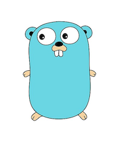

# Convert 2 Code Holiday Hack 2018

## Intro to Go

### https://bit.ly/2ExgRXx

**Welcome!**

This is an introduction to the [Go programming language](https://golang.org/).  The first important thing to know about Go is that it has a mascot:

This is a gopher.  Its job is to run around and do things you tell it to do.

For our lessons, we will be using a website called [goplay.space](https://goplay.space/).  We will be learning some basic Go while directing our gopher around the screen.

Here are all the lessons:

1. [Hello, Convert2Code!](./lesson_1.go)
2. [Let's draw something](./lesson_2.go)
3. [Functions](./lesson_3.go)
4. [Functions with Arguments](./lesson_4.go)
5. [More Functions!](./lesson_5.go)
6. [Loops](./lesson_6.go)
7. [Fun with Random Colors](./lesson_7.go)
8. [Gopher Needs a Map](./lesson_8.go)
9. [Moving From A to B](./lesson_9.go)
10. [Moving From A to B (with trigonometry)](./lesson_10.go)

Questions?  converttocode@gmail.com